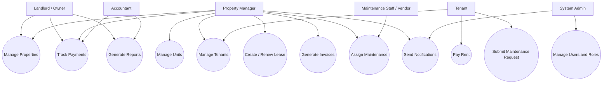
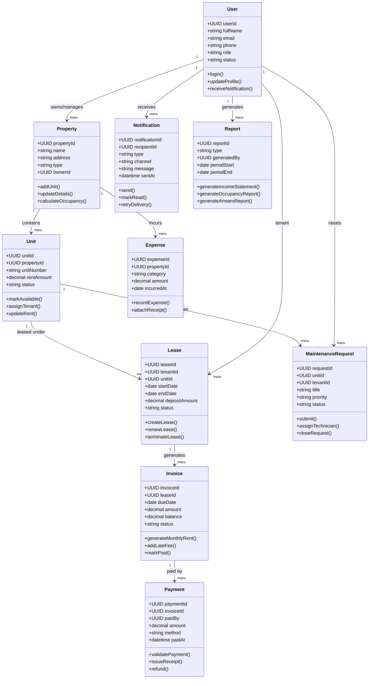

# Rent Management Website UML

## Overview

This document describes the UML-style design for a rent management website. The platform is intended to support landlords, property managers, tenants, maintenance staff, accountants, and system administrators.

The system should cover:

- property and unit management
- tenant onboarding and profile management
- lease management
- rent billing and payment tracking
- maintenance request handling
- notifications and reminders
- expense and financial reporting
- admin and audit controls

## Main Actors

### 1. Landlord / Owner

- Manage properties
- View units and occupancy
- Approve tenants
- Monitor payments
- Review reports

### 2. Property Manager

- Create and update properties
- Manage leases
- Track rent collection
- Assign maintenance requests
- Communicate with tenants

### 3. Tenant

- Register and log in
- View lease details
- Pay rent online
- View invoices and receipts
- Submit maintenance requests
- Receive reminders and notices

### 4. Maintenance Staff / Vendor

- View assigned maintenance work
- Update request status
- Record completion notes

### 5. Accountant

- Track income and expenses
- Reconcile payments
- Generate financial reports

### 6. System Admin

- Manage users and roles
- Configure system settings
- Review audit logs

## Functional Modules

### Authentication and Access Control

- User registration
- Login and logout
- Password reset
- Role-based access control
- User status management

### Property Management

- Add property
- Edit property
- Delete property
- Add units under a property
- Update unit status
- Track occupancy

### Tenant Management

- Create tenant profile
- Upload tenant documents
- Store contact information
- Track tenant history

### Lease Management

- Create lease
- Renew lease
- Terminate lease
- Store lease terms
- Store deposit information
- Track lease status

### Billing and Payments

- Generate monthly rent invoices
- Add late fees
- Accept online payments
- Generate receipts
- Track unpaid balances
- View payment history

### Maintenance Management

- Create maintenance request
- Set priority level
- Assign staff/vendor
- Track request progress
- Close resolved request

### Notifications

- Send rent reminders
- Send lease expiry reminders
- Send payment confirmation
- Send maintenance updates

### Accounting and Reporting

- Record expenses
- Track owner income
- Generate occupancy reports
- Generate arrears reports
- Generate income reports

### Admin and Audit

- Manage roles and permissions
- Configure penalties and policies
- Track all important activities in audit logs

## Use Case UML

## Class Diagram UML

## Recommended Website Pages

- Home page
- About platform page
- Login page
- Registration page
- Dashboard
- Property listing page
- Property details page
- Unit management page
- Tenant management page
- Lease management page
- Billing and payments page
- Maintenance request page
- Reports page
- Admin settings page

## Suggested MVP Development Order

### Phase 1

- User authentication
- Role management
- Property and unit management
- Tenant profiles
- Lease creation

### Phase 2

- Invoice generation
- Rent payments
- Payment history
- Notifications and reminders

### Phase 3

- Maintenance request workflow
- Expense management
- Reports dashboard

### Phase 4

- Advanced analytics
- Audit log system
- Multi-property scaling
- Vendor management improvements

## Summary

This UML design gives a complete foundation for building a rent management website. It includes the actors, system modules, major use cases, and core business classes needed for a real-world platform.
